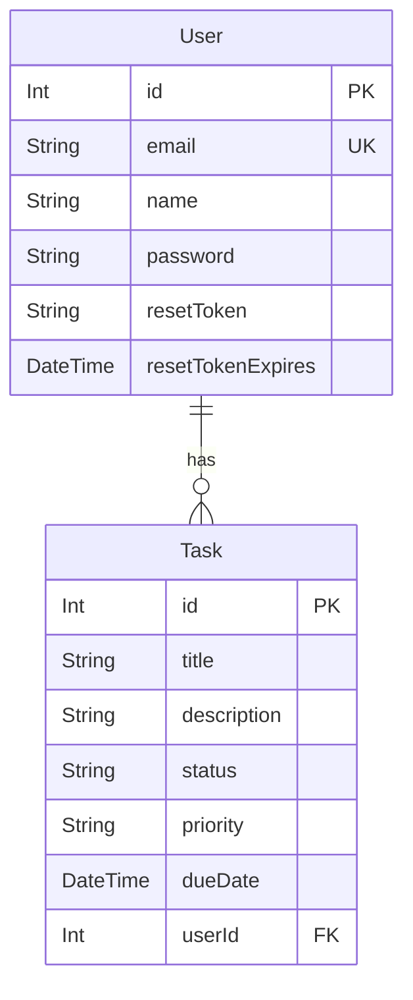

# TaskFlow API

Welcome to the TaskFlow API! This is a robust and scalable backend solution for a task management application, built with NestJS, Prisma, and other modern technologies.

## ✨ Live Demo

_There is no live demo available at the moment._

## 🚀 Features

- **User Authentication:** Secure user registration and login with JWT (JSON Web Tokens).
- **Password Reset:** Users can reset their passwords via email.
- **Task Management:** Create, read, update, and delete tasks.
- **Task Prioritization:** Assign priorities to your tasks (LOW, MEDIUM, HIGH).
- **Database:** Uses Prisma with a SQLite database for easy setup and development.
- **Scalable Architecture:** Built with NestJS, a progressive Node.js framework for building efficient, reliable and scalable server-side applications.

## 🛠️ Technologies

- **[NestJS](https://nestjs.com/):** A progressive Node.js framework for building efficient, reliable and scalable server-side applications.
- **[Prisma](https://www.prisma.io/):** A next-generation ORM for Node.js and TypeScript.
- **[SQLite](https://www.sqlite.org/index.html):** A C-language library that implements a small, fast, self-contained, high-reliability, full-featured, SQL database engine.
- **[JWT](https://jwt.io/):** JSON Web Tokens for secure authentication.
- **[Nodemailer](https://nodemailer.com/):** A module for Node.js applications to allow easy as cake email sending.
- **[TypeScript](https://www.typescriptlang.org/):** A typed superset of JavaScript that compiles to plain JavaScript.
- **[Prettier](https://prettier.io/):** An opinionated code formatter.
- **[ESLint](https://eslint.org/):** A tool for identifying and reporting on patterns found in ECMAScript/JavaScript code.

## 🏁 Getting Started

To get a local copy up and running, follow these simple steps.

### Prerequisites

- [Node.js](https://nodejs.org/en/) (v16 or higher)
- [npm](https://www.npmjs.com/)

### Installation

1.  Clone the repo
    ```sh
    git clone https://github.com/your_username/taskflow-backend.git
    ```
2.  Install NPM packages
    ```sh
    npm install
    ```
3.  Set up the database
    ```sh
    npx prisma migrate dev
    ```

### Environment Variables

Create a `.env` file in the root of the project and add the following environment variables:

```env
DATABASE_URL="file:./prisma/dev.db"
JWT_SECRET="your_jwt_secret"
MAIL_HOST="your_mail_host"
MAIL_USER="your_mail_user"
MAIL_PASS="your_mail_password"
MAIL_FROM="your_mail_from"
```

### Running the application

```sh
# Development
npm run start

# Watch mode
npm run start:dev

# Production mode
npm run start:prod
```

## 📄 API Endpoints

### Auth

- `POST /auth/register`: Register a new user.
- `POST /auth/login`: Login an existing user.
- `POST /auth/logout`: Logout the current user.
- `POST /auth/forgot-password`: Send a password reset email.
- `POST /auth/reset-password`: Reset the user's password.

### User

- `GET /user`: Get the current user's information.

### Task

- `POST /task`: Create a new task.
- `GET /task`: Get all tasks for the current user.
- `PATCH /task/:id`: Update a task.
- `DELETE /task/:id`: Delete a task.

## 📁 Project Structure

```
taskflow-backend/
├── prisma/
│   ├── dev.db
│   ├── migrations/
│   └── schema.prisma
├── src/
│   ├── auth/
│   ├── common/
│   ├── mail/
│   ├── prisma/
│   ├── task/
│   ├── user/
│   ├── app.module.ts
│   └── main.ts
├── .env.example
├── .gitignore
├── package.json
└── README.md
```

## 📊 Database Schema



## 📜 License

Distributed under the UNLICENSED License. See `LICENSE` for more information.
